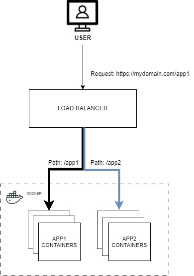

# Carapace LB - A Path Based Load Balancer

Carapace LB is a path-based load balancer that leverages the [Pingora Framework by Cloudflare](https://github.com/cloudflare/pingora) to manage and route traffic efficiently.

```
NOTE: I havent included SNI here because I dont have yet a good understanding on how to apply SNI in pingora.
```

## Configuration

Since the application uses Pingora, it also inherit its configurations. To know more about Pingora related configuration, please refer here:
https://github.com/cloudflare/pingora/blob/main/docs/user_guide/conf.md

The configuration uses the TOML format. For more details, refer to the [TOML documentation](https://toml.io/en/v1.0.0).

# High Level Diagram



### `[load_balancer]`
Configure the load balancer.

| Property     | Description                                                           |
|--------------|-----------------------------------------------------------------------|
| `host`       | The address of the load balancer.                                     |
| `port`       | The port on which the load balancer will listen.                      |
| `routes_path`| The file where routes will be saved during service discovery updates. |
| `enable_tls_ssl`| Set to ```true``` to enable TLS/SSL. Set to ```false``` to disable TLS/SSL. |
| `ca_crt_path`| The certficate path for the .crt file. |
| `ca_pem_path`| The certficate path for the .pem file. |
| `allow_file_types_pattern`| The regular expression pattern for matching files in the url path. |
| `debug`| Set to empty string ```""```. If set to ```"INFO"``` it will only print minimal info. such as Upstream Address and the URL Path. If set to ```"DEBUG"``` it will only print minimal info. such as Upstream Address and all the request information.   |

#### Example
```toml
[load_balancer]
host="0.0.0.0"
port=6170
routes_path="routes.json"
enable_tls_ssl=true
ca_crt_path="certs/localhost.crt"
ca_pem_path="certs/localhost.pem"
allow_file_types_pattern="[0-9|_|-|A-Z|a-z]*\\.(js|css|png|jpeg|jpg|ico)"
debug="INFO"
```

### `[[proxy_services]]`

**When enabling ```use_container``` please make sure that the load balancer has local access to the docker daemon and to the network of the containers.**

Configure the proxy services for container discovery based on container labels.

| Property               | Description                                                                 |
|------------------------|-----------------------------------------------------------------------------|
| `container_label_key`  | The key of the container label (used if `use_container` is set to `true`).  |
| `container_label_value`| The value of the container label (used if `use_container` is set to `true`).|
| `path`                 | The URL path to match. If the URL path matches, traffic is routed to this proxy service. |
| `port`                 | The port on which the proxy service listens.                                |
| `use_container`        | Set to `true` if upstreams are containers. The load balancer should be containerized and in the same network as the containers. Set to `false` when targeting specific addresses. |
| `host`                 | The specific addresses to load balance. Useful if applications are on separate machines. |

#### Example
```toml
[[proxy_services]]
container_label_key="cbl.dev.nginx"
container_label_value="groupA"
path = "/"
port = 3101
use_container=false
host = "0.0.0.0"

[[proxy_services]]
container_label_key="cbl.dev.nginx"
container_label_value="groupC"
path="/"
use_container=false
port = 3102
host = "0.0.0.0"
```

### `[health_check]`
Configure health checks and service discovery.

For more details, refer to the [Pingora LoadBalancer documentation](https://docs.rs/pingora/0.2.0/pingora/lb/struct.LoadBalancer.html#structfield.health_check_frequency).

| Property                | Description                                                             |
|-------------------------|-------------------------------------------------------------------------|
| `health_check_frequency`| The interval (in milliseconds) at which health checks are performed.    |
| `update_frequency`      | The interval (in milliseconds) at which service discovery is performed. |
| `parallel_health_check` | Set to `false` to perform health checks sequentially.                   |

#### Example
```toml
[health_check]
health_check_frequency=1000
update_frequency=1500
parallel_health_check=false
```

### Build

```
cargo build
```

#### Build Specific Platform

```
cargo build --target=x86_64-unknown-linux-gnu
```

See ```rustup target list``` for the list of platforms.

### Test

```
cargo test -- --nocapture
```

### Run

```
cargo run
```

# Developer
- JP Mateo(jpmateo022@gmail.com)